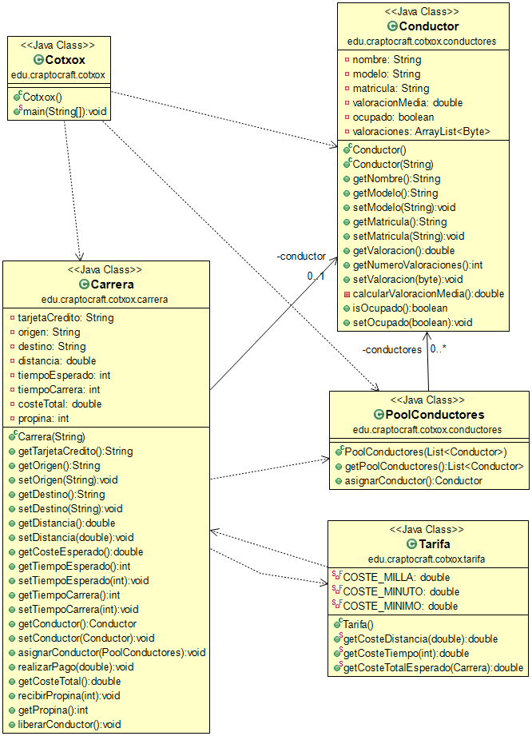

# Cotxox

**Table of contents**

-   [**Introduction**](#introduction)
-   [**About the exam**](#about-the-exam)
-   [**UML Diagram**](#uml-diagram)
-   [**Application output**](#application-output)

## Introduction

This is an exam in Java of previous years of Proggramation in CIFP Francesc de Borja Moll. The idea was to practice Java and gain a deeper understanding of Classes and Lists.   

**Link of the exam:** [Cotxox](https://github.com/dfleta/cotxox).  

## About the exam

We are going to build a prototype of the Cotxox application that allows to manage the transfer of tourists from the airport to certain areas of the island of Mallorca.

## UML Diagram

## Application output

